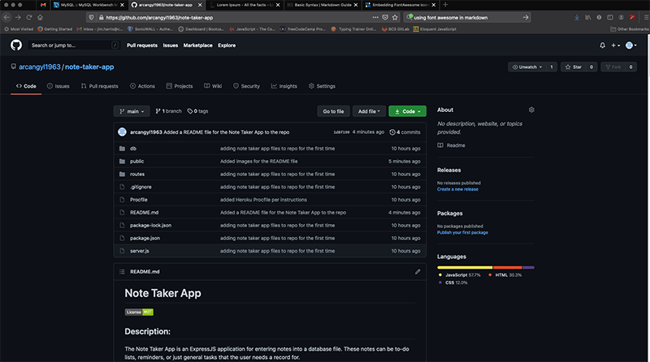
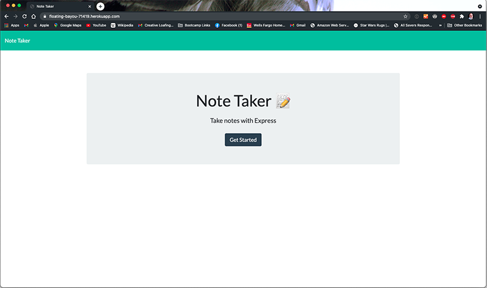
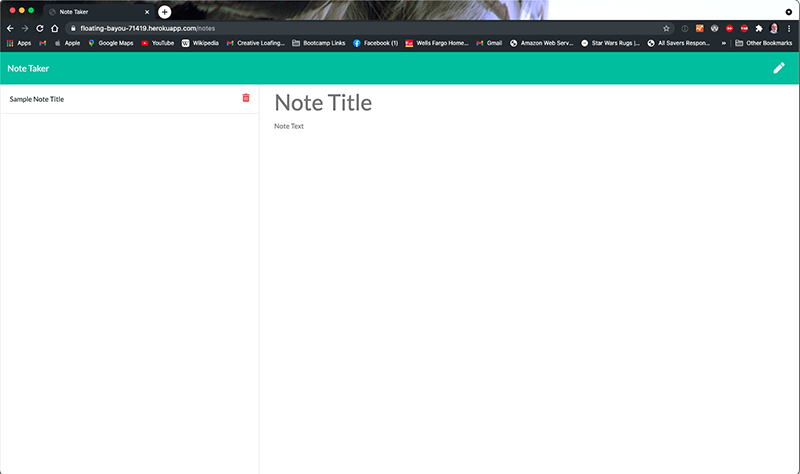
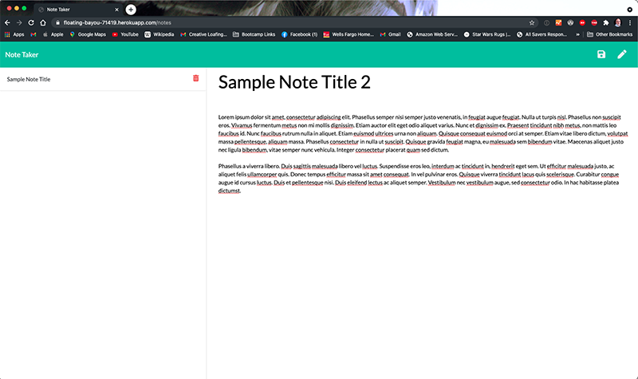
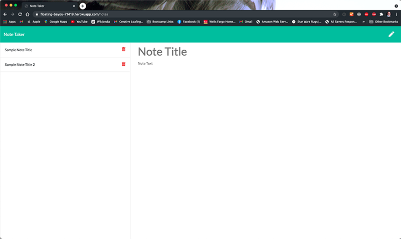
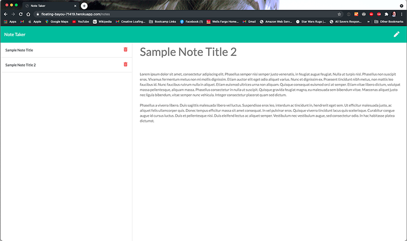

# Note Taker App 

 

## Description: 

The Note Taker App is an ExpressJS application for entering notes into a database file. These notes can be to-do lists, reminders, or just general tasks that the user needs a record for. 

The Note Taker App makes it simple and easy for the user to create, view, and delete notes. 

---

## Table of Contents 

[Installation](#installation) 

[Usage](#usage) 

[Deployed App Link](#deployed-app) 

[License](#license) 

[Contributors](#contributors) 

[Tests](#tests) 

[Questions](#Questions) 

---

## Installation: 

My files can be accessed in the repository [HERE](https://github.com/arcangyl1963/note-taker-app) 

The image below shows the repository where my project files are located:

Install the application by cloning the repo from the link above or by downloading the files to your local drive.

The repository will contain all of the files needed to run the application:

* A 'db' directory containing the JSON database file where the notes are stored.
* A 'public' directory containing the assets directory and the two HTML files for the main landing page and the notes app page.
  * The 'assets' directory contains directories for images, CSS, and Javascript files.
    * The 'js' directory contains the index.js script file.
* A 'routes' directory containing the script files for the api and view routes.
* A 'tests' directory containing the four test scripts for each class.
* A package.json file that contains the dependencies required for the application to run and the testing script path.
* An server.js script file that is invoked in NodeJS to run the application.

First begin by installing any dependencies required to run the application and to setup the development environment on your local repository. 

In Terminal or a similar bash command-line utility, navigate to the working directory and enter: 

~~~
npm install OR npm i
~~~

This will install any package dependencies defined in the package.json file.
Once the required packages have been installed, the application can be launched.

---

## Usage: 
To run the application locally type the following into Terminal or the command-line utility of your choice:

~~~
node server.js
~~~

The application can be accessed at http;//localhost:8080.

## Deployed-app:

The Heroku deployed application can be accessed at the link below:

[Note Taker App](https://floating-bayou-71419.herokuapp.com/)

The application loads first to a main landing page shown below. Clicking the 'Get Started' button loads the note taking panel for the application. 

The right side of the note panel contains the title entry field and the note text entry field where the user enters the note information. The left side displays the list of saved notes.

When the user enters a title and the note text into the text area, a Save icon will display next to the New Note icon.

Clicking the Save icon will save the note to the database file and the note will display in the left-side note list.

When the user clicks on one of the notes in the note list, the title and contents of the note will display in the text area to the right.

---

## License: 

 This software is licensed under an MIT license:  Copyright © 2021 Arcangyl Studios  Permission is hereby granted, free of charge, to any person obtaining a copy of this software and associated documentation files (the 'Software'), to deal in the Software without restriction, including without limitation the rights to use, copy, modify, merge, publish, distribute, sublicense, and/or sell copies of the Software, and to permit persons to whom the Software is furnished to do so, subject to the following conditions: The above copyright notice and this permission notice shall be included in all copies or substantial portions of the Software. THE SOFTWARE IS PROVIDED 'AS IS', WITHOUT WARRANTY OF ANY KIND, EXPRESS OR IMPLIED, INCLUDING BUT NOT LIMITED TO THE WARRANTIES OF MERCHANTABILITY, FITNESS FOR A PARTICULAR PURPOSE AND NONINFRINGEMENT. IN NO EVENT SHALL THE AUTHORS OR COPYRIGHT HOLDERS BE LIABLE FOR ANY CLAIM, DAMAGES OR OTHER LIABILITY, WHETHER IN AN ACTION OF CONTRACT, TORT OR OTHERWISE, ARISING FROM, OUT OF OR IN CONNECTION WITH THE SOFTWARE OR THE USE OR OTHER DEALINGS IN THE SOFTWARE. 

---

## Contributors: 

James Harris 

---

## Tests: 

There were 4 tests created for each of the classes. All 4 tests passed during testing. 
To run the tests, enter the following command into Terminal or command-line bash utility of your choice: 

~~~
npm test
~~~

---

## Questions: 

- Feel free to email me with any questions about this project at: arcangyl@gmail.com 

 

- My GitHub profile may be viewed by clicking [here](https://github.com/arcangyl1963).